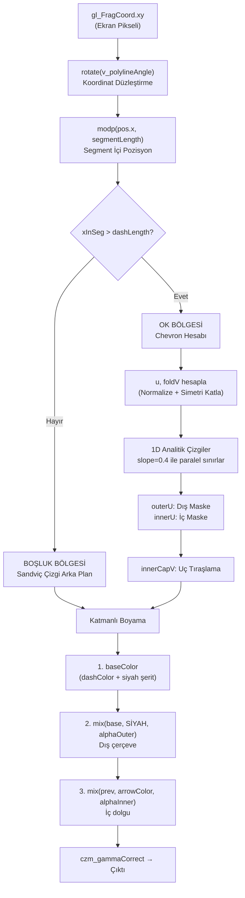

# ChevronArrowEdgeMaterialProperty_sandwichLine — Satır Satır Açıklama

> [!NOTE]
> Bu açıklama, [shaders.ts satır 3886–4040](file:///d:/sates/paralel_harita/Harita_Clone_Deneme/web/src/polyline_work/shaders.ts#L3886-L4040) arasındaki, cursor'un üzerinde olduğu aktif sınıfı kapsamaktadır.

---

## 1. Genel Mimari — Ne Yapıyor?

Bu sınıf, Cesium polyline üzerinde aşağıdaki görsel efekti üretir:

```
  ─────── ▶ ─────── ▶ ─────── ▶ ───────
```

Daha detaylı olarak:
- **Arka plan**: Renkli bir şerit (dashColor) + ortasından geçen ince siyah çizgi (**sandviç çizgi**)
- **Ok işaretleri**: Belirli aralıklarla tekrar eden **chevron** (`>`) şeklinde oklar
- Chevron'un **dış kenarı siyah**, **iç kısmı beyaz/arrowColor** ile boyanır

---

## 2. TypeScript Sınıf Yapısı (Satır 3886–4040)

### 2.1 Sınıf Tanımı ve Property'ler (3886–3889)

```typescript
export class ChevronArrowEdgeMaterialProperty_sandwichLine implements Cesium.MaterialProperty {
    private _arrowColor: Cesium.Property;   // Chevron okunun iç rengi (beyaz vb.)
    private _dashColor: Cesium.Property;    // Arka plan şerit rengi (yeşil, pembe vb.)
    private _definitionChanged: Cesium.Event;
```

- `Cesium.MaterialProperty` arayüzünü uygular → Cesium'un polyline materyali olarak kullanılabilir.
- `_arrowColor`: Chevron'un iç dolgusunun rengi.
- `_dashColor`: Ok olmayan kısımlardaki (dash) arka plan şerit rengi. `CallbackProperty` olarak gelir, yani **dinamik olarak değişebilir**.
- `_definitionChanged`: Cesium'un property değişikliklerini dinlemek için kullandığı event.

### 2.2 Constructor (3891–4015)

```typescript
constructor(
    arrowColor: Cesium.Color,
    dashColor: Cesium.CallbackProperty
) {
    this._arrowColor = new Cesium.ConstantProperty(arrowColor);
    this._dashColor = dashColor;
    this._definitionChanged = new Cesium.Event();
```

- `arrowColor` sabit bir renk olarak `ConstantProperty`'ye sarılır.
- `dashColor` ise `CallbackProperty` olarak doğrudan atanır (her frame'de farklı renk döndürebilir).

### 2.3 Material Cache Kontrolü (3899–3900)

```typescript
if (!(Cesium.Material as any)._materialCache._materials["ChevronArrowEdgeMaterialProperty_sandwichLine"]) {
    (Cesium.Material as any)._materialCache.addMaterial("ChevronArrowEdgeMaterialProperty_sandwichLine", {
```

- Cesium'un **material önbelleğinde** bu materyal daha önce kayıtlı mı kontrol eder.
- Yoksa bir kez kaydeder. Bu sayede aynı shader birden fazla kez derlenmez; **sadece ilk instance** kaydı yapar, sonrakiler mevcut kaydı kullanır.

### 2.4 Fabric Tanımı — Uniforms (3901–3910)

```typescript
fabric: {
    type: "ChevronArrowEdgeMaterialProperty_sandwichLine",
    uniforms: {
        arrowColor: Cesium.Color.WHITE,
        dashColor: Cesium.Color.fromBytes(239, 12, 249, 255),
        dashLength: 48.0,
        arrowLength: 12.0,
        minV: 0.30,
        maxV: 0.70
    },
```

| Uniform | Varsayılan | Açıklama |
|---------|-----------|----------|
| `arrowColor` | Beyaz | Chevron'un iç dolgu rengi |
| `dashColor` | Pembe (#EF0CF9) | Arka plan şerit rengi |
| `dashLength` | 48 px | İki chevron arası boşluğun piksel uzunluğu |
| `arrowLength` | 12 px | Bir chevron'un piksel genişliği |
| `minV` | 0.30 | Çizginin dikey alt sınırı (0.0–1.0 arası) |
| `maxV` | 0.70 | Çizginin dikey üst sınırı |

> [!IMPORTANT]
> `minV` ve `maxV`, polyline'ın dikey boyutunun yalnızca %40'lık ortasını kullanmaya zorlar. Bu sayede çizgi, polyline genişliğinin tamamını doldurmaz ve daha zarif görünür.

---

## 3. GLSL Shader — Satır Satır (3911–4009)

### 3.1 Uniform Bildirimleri (3912–3918)

```glsl
uniform vec4 arrowColor;
uniform vec4 dashColor;
uniform float dashLength;
uniform float arrowLength;
uniform float minV;
uniform float maxV;
in float v_polylineAngle;
```

- JavaScript tarafından gönderilen değerler burada GLSL'e bağlanır.
- `v_polylineAngle`: Cesium'un vertex shader'ından gelen **polyline segmentinin ekran üzerindeki açısı** (radyan). Çizginin hangi yöne baktığını bildirir.

### 3.2 `rotate()` Yardımcı Fonksiyonu (3920–3924)

```glsl
mat2 rotate(float rad) {
    float c = cos(rad);
    float s = sin(rad);
    return mat2(c, s, -s, c);
}
```

**Ne yapar:** Verilen açıya göre 2D döndürme matrisi oluşturur.

**Nerede kullanılır:** `gl_FragCoord.xy` (ekran pikseli) bu matrisle çarpılarak, polyline'ın açısına göre koordinat sistemi **düzleştirilir**. Böylece çizgi hangi açıda olursa olsun, desenleri her zaman yatay gibi hesaplayabiliriz.

### 3.3 `modp()` Yardımcı Fonksiyonu (3926–3929)

```glsl
float modp(float x, float len) {
    float m = mod(x, len);
    return m < 0.0 ? m + len : m;
}
```

**Ne yapar:** Her zaman **pozitif** modülo döndürür. GLSL'in standart `mod()` fonksiyonu negatif değerlerde negatif sonuç verebilir; bu fonksiyon bunu düzeltir.

**Neden gerekli:** Ekran koordinatları negatif olabilir. Deseni tekrar ettirmek için her zaman pozitif bir değere ihtiyacımız var.

---

### 3.4 `czm_getMaterial()` — Ana Fonksiyon (3931–4009)

Bu, Cesium'un her piksel için çağırdığı **fragment shader** fonksiyonudur. Her piksel için "bu piksel ne renk olacak?" sorusuna cevap verir.

#### 3.4.1 Başlangıç ve Koordinat Sistemi (3931–3940)

```glsl
czm_material material = czm_getDefaultMaterial(materialInput);
vec2 st = materialInput.st;
```
- `czm_getDefaultMaterial`: Cesium'un varsayılan materyalini alır (sonra üzerine yazacağız).
- `st`: Polyline'ın **yüzey koordinatları**. `st.s` yatay (çizgi boyunca), `st.t` dikey (çizgi genişliği boyunca, 0.0 = alt, 1.0 = üst).

```glsl
vec2 pos = rotate(v_polylineAngle) * gl_FragCoord.xy;
```
- `gl_FragCoord.xy`: Bu pikselin **ekran üzerindeki mutlak konumu** (piksel cinsinden).
- `rotate(v_polylineAngle) *`: Polyline'ın açısına göre döndürüp düzleştiriyoruz.
- Sonuç: `pos.x` artık çizgi boyunca ilerleyen eksen, `pos.y` ise çizgiye dik eksen oluyor.

> [!TIP]
> Bu döndürme sayesinde çizgi 45° açıyla bile gitse, shader hep "düz yatay çizgi üzerinde çalışıyormuş gibi" hesap yapabilir.

```glsl
float pixelDashLength  = max(dashLength  * czm_pixelRatio, 1.0);
float pixelArrowLength = max(arrowLength * czm_pixelRatio, 1.0);
float pixelSegmentLength = pixelDashLength + pixelArrowLength;
```
- `czm_pixelRatio`: Retina/HiDPI ekranlar için ölçekleme faktörü.
- `pixelSegmentLength`: Bir "vagon" = boşluk + ok. Bu vagon sonsuz tekrar eder.

```
|<--- pixelDashLength --->|<- pixelArrowLength ->|
|      BOŞLUK (Dash)      |    CHEVRON (Ok)      |
|__________________________|______________________|
```

```glsl
float xInSeg = modp(pos.x, pixelSegmentLength);
```
- `pos.x`'i segment uzunluğuna göre modülo alır → bu pikselin **kendi segmenti içindeki pozisyonunu** bulur.
- Sonuç: 0 ile `pixelSegmentLength` arası bir değer. Her segment için aynı desen tekrar eder.

#### 3.4.2 Ok Bölgesi Tespiti ve Anti-Aliasing (3942–3944)

```glsl
float fwX = max(fwidth(pos.x), 1e-5);
float blurX = fwX * 0.5;
float inArrow = smoothstep(pixelDashLength - blurX, pixelDashLength + blurX, xInSeg);
```

- `fwidth(pos.x)`: Bu pikselden komşu piksele `pos.x`'in ne kadar değiştiğini hesaplar (**piksel türevi**). Anti-aliasing için kritik.
- `blurX`: Yarım piksel bulanıklık alanı.
- `inArrow`: 
  - `xInSeg < pixelDashLength` → **0.0** (boşluk bölgesindeyiz)
  - `xInSeg > pixelDashLength` → **1.0** (ok bölgesindeyiz)
  - Aradaki geçiş `smoothstep` ile yumuşatılır (pürüzsüz kenar).

#### 3.4.3 Chevron İç Koordinatları (3946–3949)

```glsl
float u = clamp((xInSeg - pixelDashLength) / pixelArrowLength, 0.0, 1.0);
float v = st.t;
float foldV = abs(v - 0.5) * 2.0;
```

- `u`: Pikselin ok bölgesi içindeki **yatay normalize pozisyonu** (0.0 = ok başı, 1.0 = ok sonu).
- `v`: Pikselin **dikey pozisyonu** (0.0 = çizgi altı, 1.0 = çizgi üstü).
- `foldV`: **Y ekseni simetri katlaması**. V'yi 0.5 merkezinden katlayarak 0.0–1.0 aralığına getirir:

```
v:     0.0  0.1  0.2  0.3  0.4  0.5  0.6  0.7  0.8  0.9  1.0
foldV: 1.0  0.8  0.6  0.4  0.2  0.0  0.2  0.4  0.6  0.8  1.0
```

> [!IMPORTANT]
> Bu katlama, chevron'un **yukarı ve aşağı kollarının tamamen simetrik** olmasını garanti eder. Tek bir kol çizeriz, katlama sayesinde diğer kol otomatik olarak aynalı çıkar. Ortadaki dikişi (seam) de böylece ortadan kaldırırız.

#### 3.4.4 Piksel Türevleri (3951–3955)

```glsl
float fwU = max(fwidth(u), 1e-5);
float fwV = max(fwidth(v) * 2.0, 1e-5);

float blurU = fwU * 0.5;
float blurV = fwV * 0.5;
```

- `fwU`: U ekseninde bir pikselden diğerine olan değişim miktarı.
- `fwV`: V ekseninde bir pikselden diğerine olan değişim miktarı. `* 2.0` çünkü `foldV` hesabında `abs()` ile katlama yaptık, bu türevi iki katına çıkarır.
- `blurU`/`blurV`: Yarım piksellik kenar yumuşatma mesafeleri.

---

### 3.5 ⭐ 1D Analitik Chevron Çizimi (3957–3980)

Bu bölüm, kodun **en kritik parçası** — chevron şeklinin matematik ile nasıl çizildiği.

#### 3.5.1 Eğim Tanımı (3961)

```glsl
float slope = 0.4;
```

Chevron kollarının eğimi. Tüm çizgiler (iç ve dış sınırlar) **aynı eğime** sahiptir. Bu sayede çizgiler birbirine tamamen **paralel** olur — asla birbirine yaklaşmaz veya uzaklaşmaz.

#### 3.5.2 Dış Sınır Çizgileri (3964–3965)

```glsl
float leftOutU  = 0.4 - slope * foldV;
float rightOutU = 1.0 - slope * foldV;
```

Bu iki satır, chevron'un **dış kenarlarının** (siyah çerçeve) U eksenindeki pozisyonlarını hesaplar.

**Geometrik anlam:**

```
foldV=0 (merkez):  leftOutU = 0.4    rightOutU = 1.0
foldV=0.5:         leftOutU = 0.2    rightOutU = 0.8
foldV=1.0 (kenar): leftOutU = 0.0    rightOutU = 0.6
```

Bu, yukarıdan aşağıya doğru **sola kayan iki paralel çizgi** oluşturur:

```
foldV=1.0  |0.0 ============= 0.6|          (en dış kenar)
foldV=0.5  |    0.2 ============= 0.8|      (orta)
foldV=0.0  |        0.4 ============= 1.0|  (merkez çizgisi)
```

Bu aşağıdan yukarıya bakıldığında **">"** şeklini oluşturur!

#### 3.5.3 İç Sınır Çizgileri (3968–3969)

```glsl
float leftInnU  = 0.5 - slope * foldV;
float rightInnU = 0.9 - slope * foldV;
```

Aynı eğimle, ama **0.1 birim sağa kaydırılmış** (içe doğru daraltılmış) sınırlar. Bu, chevron'un **iç dolgusunun** (arrowColor) sınırlarıdır.

```
Dış Sol: 0.4 - 0.4*foldV     İç Sol: 0.5 - 0.4*foldV    (aradaki fark = 0.1)
Dış Sağ: 1.0 - 0.4*foldV     İç Sağ: 0.9 - 0.4*foldV    (aradaki fark = 0.1)
```

> [!TIP]
> Dış ve iç sınırlar arasındaki sabit **0.1 birimlik fark**, chevron'un siyah kenar kalınlığını belirler. Bu değer her yükseklikte aynı olduğundan, kenar kalınlığı chevron boyunca **tamamen sabit** kalır.

#### 3.5.4 Smoothstep Maskeleri (3971–3972)

```glsl
float outerU = smoothstep(leftOutU - blurU, leftOutU + blurU, u) 
             * (1.0 - smoothstep(rightOutU - blurU, rightOutU + blurU, u));

float innerU = smoothstep(leftInnU - blurU, leftInnU + blurU, u) 
             * (1.0 - smoothstep(rightInnU - blurU, rightInnU + blurU, u));
```

**Ne yapar:**

Her satır bir **"aralık maskesi"** oluşturur:

```
smoothstep(sol - blur, sol + blur, u)  →  sol sınırdan sonra 0→1 geçiş (sol kenar)
1.0 - smoothstep(sağ - blur, sağ + blur, u)  →  sağ sınırdan sonra 1→0 geçiş (sağ kenar)
```

İkisinin çarpımı:

```
u:      ... sol-blur  sol  sol+blur ... sağ-blur  sağ  sağ+blur ...
outerU: ... 0.0       0.5  1.0     ... 1.0        0.5  0.0      ...
```

- `outerU = 1.0` → piksel **dış sınırların içinde** (tüm chevron alanı)
- `innerU = 1.0` → piksel **iç sınırların içinde** (sadece dolgu alanı)

#### 3.5.5 Uç Noktası Tıraşlama (3976)

```glsl
float innerCapV = 1.0 - smoothstep(0.8 - blurV, 0.8 + blurV, foldV);
```

Chevron'un U ekseninde giderek sivrilmesine rağmen, ucun (tepesinin) sonsuza kadar gitmesini engeller.

- `foldV < 0.8` → `innerCapV = 1.0` (görünür)
- `foldV > 0.8` → `innerCapV = 0.0` (kesilir)

> [!IMPORTANT]
> Uç kesimi **sadece iç oka** uygulanır! Dış siyah çerçeve `foldV = 1.0`'a (en tepeye) kadar çıkar. Bu sayede chevron'un uç noktasında ince bir siyah sivri uç oluşur — tıpkı gerçek bir ok gibi.

#### 3.5.6 Final Maske Hesabı (3979–3980)

```glsl
float alphaOuter = outerU * inArrow;
float alphaInner = innerU * innerCapV * inArrow;
```

- `alphaOuter`: Dış sınır maskesi × ok bölgesinde mi. Boşluk bölgesinde her şey sıfırlanır.
- `alphaInner`: İç dolgu maskesi × uç tıraşlama × ok bölgesinde mi.

---

### 3.6 Sandviç Çizgi Arka Plan Hesabı (3986–3997)

Bu bölüm, **chevron olmayan** kısımlarda görünen arka plan çizgisini çizer.

#### 3.6.1 Siyah Orta Şerit (3987–3994)

```glsl
float blurZemin = max(fwidth(v), 1e-5) * 0.5;
float midV = (minV + maxV) * 0.5;                    // Ortası: 0.5
float stripeThickness = (maxV - minV) * 0.2;          // Kalınlık: 0.08
float bStart = midV - (stripeThickness * 0.5);         // 0.46
float bEnd = midV + (stripeThickness * 0.5);           // 0.54
```

```
v ekseni:
0.0 ──── 0.30(minV) ──── 0.46 ═══ 0.54 ──── 0.70(maxV) ──── 1.0
          |  dashColor   | SİYAH  |  dashColor   |
          |   şerit      | şerit  |    şerit     |
```

```glsl
float blackFactor = smoothstep(bStart - blurZemin, bStart + blurZemin, v) 
                  - smoothstep(bEnd - blurZemin, bEnd + blurZemin, v);
vec4 baseColor = mix(dashCol, blackCol, blackFactor);
```

- `blackFactor`: 0.46–0.54 arasında 1.0, dışında 0.0.
- `mix(dashCol, blackCol, blackFactor)`: Ortada siyah, kenarlar dashColor → **sandviç** görünümü!

#### 3.6.2 Dış Kenar Kırpma (3996–3997)

```glsl
float edgeAlpha = smoothstep(minV - blurZemin, minV + blurZemin, v) 
               * (1.0 - smoothstep(maxV - blurZemin, maxV + blurZemin, v));
baseColor.a *= edgeAlpha;
```

- `v < minV` (0.30) → şeffaf
- `minV < v < maxV` → opak
- `v > maxV` (0.70) → şeffaf

Bu, çizginin dikey sınırlarını pürüzsüz kırpar.

---

### 3.7 Katmanlı Renk Birleştirme (3999–4002)

```glsl
vec4 outColor = baseColor;                          // 1. Katman: Sandviç arka plan
outColor = mix(outColor, blackCol, alphaOuter);     // 2. Katman: Siyah dış çerçeve
outColor = mix(outColor, arrowCol, alphaInner);     // 3. Katman: Renkli iç dolgu
```

Aşağıdan yukarıya boyama mantığı:

| Sıra | Katman | Açıklama |
|------|--------|----------|
| 1 | `baseColor` | Sandviç çizgi arka planı (dashColor + siyah orta şerit) |
| 2 | `blackCol × alphaOuter` | Chevron'un tam dış şekli siyah olarak basılır |
| 3 | `arrowCol × alphaInner` | Chevron'un iç kısmı arrowColor ile doldurulur |

> [!TIP]
> Bu katmanlama tekniği sayesinde siyah kenar ve iç dolgu rengi **asla birbirine karışmaz**. İç dolgu her zaman siyahın üzerine yazılır, temiz bir sınır oluşur.

**Görsel temsil (bir piksel sütunu boyunca):**

```
          baseColor (dashColor)
     ┌──────────────────────────┐
     │   renkli şerit           │  ← alphaOuter=0, alphaInner=0
     │   ┌──────────────────┐   │
     │   │ SİYAH (dış kenar)│   │  ← alphaOuter=1, alphaInner=0
     │   │  ┌────────────┐  │   │
     │   │  │ BEYAZ (iç)  │  │   │  ← alphaOuter=1, alphaInner=1
     │   │  └────────────┘  │   │
     │   │ SİYAH (dış kenar)│   │
     │   └──────────────────┘   │
     │   renkli şerit           │
     └──────────────────────────┘
```

### 3.8 Son İşlemler (4004–4008)

```glsl
outColor = czm_gammaCorrect(outColor);

material.diffuse = outColor.rgb;
material.alpha   = outColor.a;
return material;
```

- `czm_gammaCorrect`: Renk uzayını düzeltir (lineer → sRGB).
- Son renk ve alfa değerleri materyale yazılır ve Cesium'a geri döner.

---

## 4. TypeScript API Metotları (4017–4040)

| Metot | Açıklama |
|-------|----------|
| `isConstant` | Arrowcolor ve dashColor sabit mi? (Cesium optimizasyonu için) |
| `definitionChanged` | Cesium'un dinlediği değişiklik event'i |
| `getType()` | Material cache'deki kayıt anahtarını döndürür |
| `getValue(time)` | Her frame'de arrowColor ve dashColor'ın güncel değerlerini uniform'lara yazar |
| `equals(other)` | İki material'in eşit olup olmadığını kontrol eder |

---

## 5. Özet Akış Diyagramı



---

## 6. Anahtar Tasarım Kararları

| Karar | Neden |
|-------|-------|
| **Sabit eğim (slope=0.4)** | Tüm kenarlar paralel → profesyonel görünüm, kalınlık sapmaz |
| **foldV simetrisi** | Tek kol çizmek yeterli, dikiş sorunu yok |
| **smoothstep + fwidth** | Donanım bağımsız anti-aliasing, retina ekranlarda bile pürüzsüz |
| **Katmanlı mix() boyama** | Renk karışması olmadan keskin sınırlar |
| **İç cap (0.8) < dış cap (1.0)** | Ucunda ince siyah sivri uç → gerçekçi ok görünümü |
| **modp() ile tekrar** | Negatif koordinatlarda bile desen bozulmaz |
